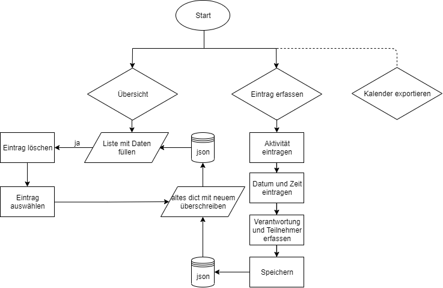

# Meine Projektidee
## Zusammenfassung
In der Pfadi Abteilung Belp gibt es viel zu organisieren. Jährlich treffen sich alle Leiter inklusive der Abteilungsleitung und es werden alle Daten für die Veranstaltungen festgelegt. Natürlich ist es danach wichtig, dass sich alle Beteiligten die richtigen Veranstaltungen in ihre Agenda eintragen. Leider wird dies von Jahr zu Jahr inkonsequenter erledigt. Wären die Termine digital in den Kalendern der Leiter, wäre es um einiges einfacher. 

## Idee
Anhand einer Software kann die Abteilung ihre Termine verwalten und direkt in die Kalender eintragen lassen. Ausserdem sollen Kollisionen vermieden werden. Die einzelnen Termine werden erfasst, die betroffene Stufe, Verantwortlichkeit und das Datum inkl. Uhrzeit werden eingetragen. Am Ende kann jeder per Link die Termin in seinen digitalen Kalender einbinden. Es muss noch ausgearbeteitet werden, für wen welche Termine sichtbar sein sollen. Das MVP ist dabei sicher, dass alle jeden Termin sehen. In der Software jedoch vorab die Abgleichung stattfindet der Stufen. Diese Arbeit soll den Grundstein der Software legen. 

## Anforderungen (MVP)
* Einlesen/Erfassen und Abspeichern der Termine
* Löschen ausgewählter Termine 
* Zuordnung der verantwortlichen Stufen (Verantwortung)
* Anzeige einer Übersicht aller erfassten Daten 

## Next Steps
* Erfasste Termine bearbeiten
* Möglichkeit bei Verantwortung "Alle"; Automatisch alle Kategorien mit einbeziehen
* Jahre abgrenzen / vergangene archivieren
* Export in Kalender
* Sortieren Übersicht

## Flussdiagramm V3

